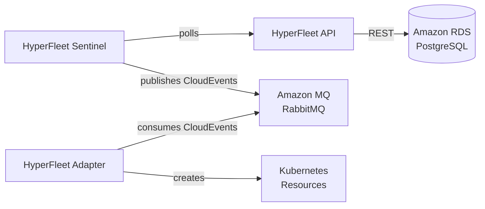

# HyperFleet System

Unified Helm chart deploying all HyperFleet components into the `hyperfleet-system` namespace using AWS managed services.

## Components



## Why Consolidated?

This chart consolidates three previously separate charts to avoid ArgoCD sync conflicts when multiple applications deploy to the same namespace.

## Prerequisites

AWS infrastructure must be provisioned first via Terraform. See [`terraform/modules/hyperfleet-infrastructure/`](../../../../terraform/modules/hyperfleet-infrastructure/) for setup, architecture details, cost estimates, and troubleshooting.

## Configuration

All components use AWS managed services with Pod Identity authentication. Role ARNs are populated from Terraform outputs via `config.yaml` and the GitOps rendering process.

Key configuration sections in `values.yaml`:

```yaml
namespace: hyperfleet-system

hyperfleetApi:
  database:
    postgresql:
      enabled: false # Disable in-cluster PostgreSQL
    external:
      enabled: true
      usePodIdentity: true
      sslMode: require
  aws:
    podIdentity:
      roleArn: "" # From Terraform output

hyperfleetSentinel:
  broker:
    rabbitmq:
      enabled: false # Disable in-cluster RabbitMQ
    external:
      enabled: true
      usePodIdentity: true
      useTLS: true
      exchange: "hyperfleet-clusters"
      exchangeType: "topic"

hyperfleetAdapter:
  broker:
    rabbitmq:
      enabled: false
    external:
      enabled: true
      usePodIdentity: true
      useTLS: true
      queue: "hyperfleet-clusters-landing-zone"
      exchange: "hyperfleet-clusters"
      routingKey: "#"
```

## Deployment

Deployed automatically via ArgoCD ApplicationSet. For manual Helm install:

```bash
helm install hyperfleet-system ./argocd/config/regional-cluster/hyperfleet-system \
  --create-namespace \
  --namespace hyperfleet-system
```

## Verification

```bash
# Check all pods are running
kubectl get pods -n hyperfleet-system

# Verify secrets are mounted
kubectl exec -n hyperfleet-system deployment/hyperfleet-api -- \
  ls -la /mnt/secrets-store/

# Health check
kubectl port-forward -n hyperfleet-system svc/hyperfleet-api 8080:8080
curl http://localhost:8080/healthz
```

## Troubleshooting

### Exchange Type Mismatch

**Symptom**: `PRECONDITION_FAILED - inequivalent arg 'type' for exchange`

Ensure both Sentinel and Adapter use `exchangeType: "topic"`. Check ConfigMaps:

```bash
kubectl get configmap hyperfleet-sentinel-broker-config -n hyperfleet-system -o yaml | grep exchange_type
kubectl get configmap hyperfleet-adapter-broker-config -n hyperfleet-system -o yaml | grep exchange_type
```

For infrastructure-level troubleshooting (RDS, Amazon MQ, Pod Identity), see the [hyperfleet-infrastructure module](../../../../terraform/modules/hyperfleet-infrastructure/).
