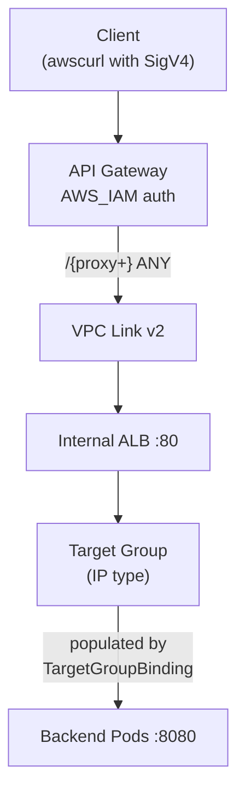

# API Gateway Module

Creates an API Gateway REST API with VPC Link integration to an internal ALB.

This creates the Internal ALB directly in Terraform, instead of relying on `Ingress` in EKS, in order to be able to set up the API Gateway integrations during the Terraform step.

The TargetGroup ARN needs to be available to the ArgoCD's Platform API helm chart, for it to create a `TargetGroupBinding` pointing at the ALB, in order to register the backend pod IPs with the target group.

## Architecture



## Connecting the Backend

After Terraform creates the infrastructure, deploy a `TargetGroupBinding` in Kubernetes
to register pod IPs with the target group:

```yaml
apiVersion: elbv2.k8s.aws/v1beta1
kind: TargetGroupBinding
metadata:
  name: platform-api
  namespace: platform-api
spec:
  serviceRef:
    name: platform-api
    port: 8080
  targetGroupARN: <target_group_arn from terraform output>
  targetType: ip
```

## Testing

Use `awscurl` to send SigV4-signed requests:

```bash
# Get the invoke URL
terraform output -raw invoke_url

# Test the API
awscurl --service execute-api --region us-west-2 \
  https://abc123.execute-api.us-west-2.amazonaws.com/prod/v0/live
```
